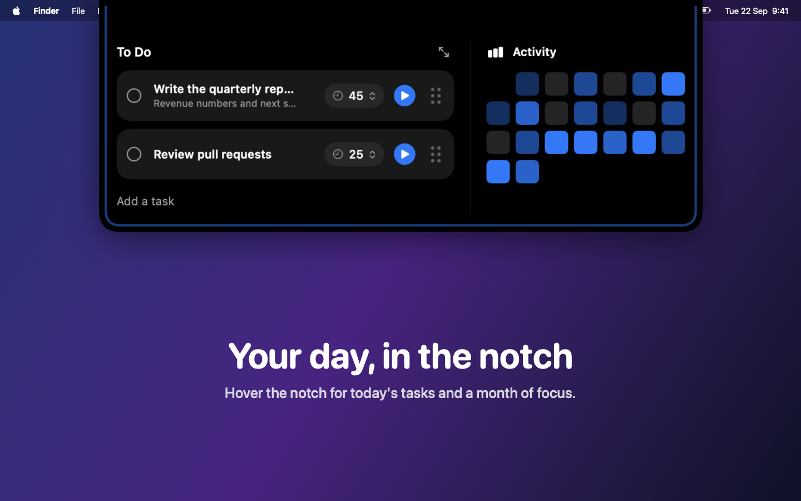
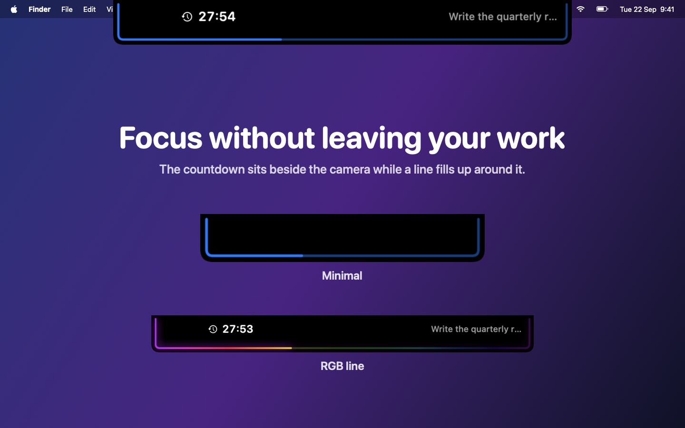
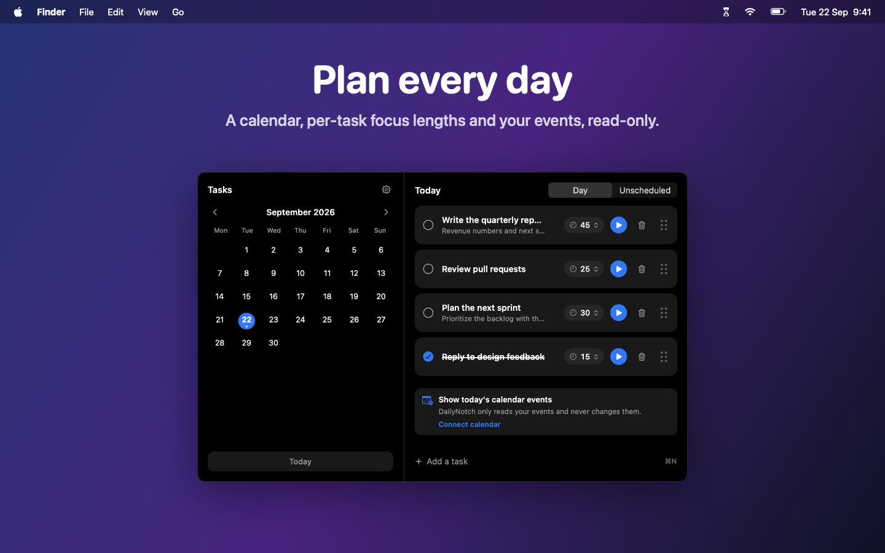
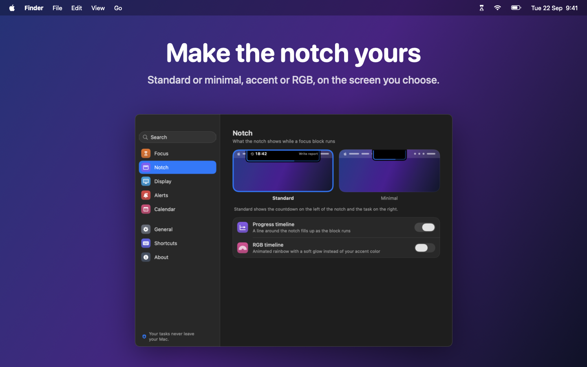

# DailyNotch

A macOS notch app that turns the space around your MacBook's notch into a
focus timer and to-do list. Hover the notch to see today's tasks and a month
of focus, start a block with one click, and watch a progress line fill up
around the notch while you work.

Native SwiftUI + AppKit. macOS 14+. English and Brazilian Portuguese.



## Install

- **Download:** the notarized `DailyNotch-X.Y.Z.dmg` from
  [Releases](https://github.com/lucianodiisouza/daily-notch-tracker/releases).
  Open it and drag DailyNotch to Applications. It is signed with a Developer
  ID and notarized by Apple, so it opens without warnings.
- **Mac App Store:** coming soon.

The download build checks GitHub for new versions and offers them in the
menu bar and in Settings > About. The App Store build updates through the
store.

## Features

- **Focus in the notch** - the countdown and the running task sit on either
  side of the notch, and a progress line wraps around it and fills up as the
  block runs. Minimal mode shows only the line; an optional RGB line glows.
- **Hover dashboard** - today's tasks (check off, start, drag to reorder,
  change the length inline) next to a month-long activity grid.
- **Tasks window** - month calendar with dots on days that have open tasks,
  Day / Unscheduled lists, notes, quick add (⌘N) and per-task focus lengths.
- **Focus engine** - counts down from a wall-clock deadline, so sleep and a
  busy Mac don't throw it off. Pauses don't count as focus time. Editing a
  running task's length re-bases the block.
- **Settings** - a PrimoDock-style window with search: focus length, notch
  style, display, alerts, calendar, general, shortcuts and about.
- **Calendar** - the day's events under your tasks, read-only via EventKit.
- **Global hotkey** - `⌘⇧Space` starts or stops focus from any app (can be
  switched off in Settings).
- **Multiple displays** - pick the screen the notch appears on; screens
  without a notch get a small pill at the top center.
- **Menu bar** - hourglass icon: Open Tasks, Start/Stop focus, Settings, Quit.
  No Dock icon until a window is open.
- **Private** - no account, no analytics. Everything is saved in one JSON
  file in the app's sandbox container. See [PRIVACY.md](PRIVACY.md).





## Build & run

```bash
open DailyNotch.xcodeproj   # then Cmd+R in Xcode
```

or from the command line:

```bash
xcodebuild -project DailyNotch.xcodeproj -scheme DailyNotch -configuration Release build
```

The app runs as a menu-bar / notch agent. Look for the hourglass in the menu
bar, then hover your notch to open the dashboard.

### Scripts

```bash
./scripts/run.sh            # build (Debug) and (re)launch
./scripts/run.sh release    # build Release and launch
./scripts/wipe.sh           # completely remove the app, data, and prefs from this Mac
./scripts/wipe.sh -y        # ... without the confirmation prompt
```

`wipe.sh` removes the built app, `~/Library/Application Support/DailyNotch`,
preferences, caches, and any installed copy. It does not touch this repo.

## Releasing

```bash
./scripts/create-dmg.sh          # Developer ID signed + notarized build/DailyNotch-X.Y.Z.dmg
./scripts/appstore.sh            # App Store archive, exported to build/appstore
./scripts/appstore.sh --upload   # ... and uploaded to App Store Connect
```

`create-dmg.sh` reads `DAILYNOTCH_SIGN_IDENTITY` and `DAILYNOTCH_NOTARY_PROFILE`
from the environment or a git-ignored `.env.local`. Bump `MARKETING_VERSION`
and `CURRENT_PROJECT_VERSION` in the Xcode project first. The App Store
listing text lives in [appstore/LISTING.md](appstore/LISTING.md).

Screenshots are rendered from the app itself: the Debug build has a snapshot
mode that draws every window with demo data (see
`DailyNotch/App/Snapshots.swift`), and `appstore/screenshots/compose.swift`
lays them out for the store (`--readme` for `docs/images`).

## Hotkey

`Cmd+Shift+Space` - toggle the active focus session.

If the day has at least one unfinished task, the first one starts. If
the day is empty, a blank session starts using the current `focusMinutes`
setting. Press the shortcut again to stop.

The hotkey is registered via Carbon's `RegisterEventHotKey` (see
`DailyNotch/Focus/GlobalHotkey.swift`), so it works from any app, not
just when DailyNotch is focused.

## Architecture

```
DailyNotch/
+- App/           NSApplication wiring, borderless notch panel, view model, focus menu state
+- Models/        Task, FocusSession, FocusSettings, Store (JSON persistence)
+- Focus/         FocusTimer (focus engine), GlobalHotkey, NotificationService
+- Notch/         Collapsed pill + expanded dashboard (to-do + activity heatmap)
+- Tasks/         Tasks window (calendar + list + add form), TaskRow, FocusTimePicker
+- Settings/      Settings window (sidebar + pages), SettingsKit, LaunchAtLoginController
+- Sync/          CalendarService (EventKit, read-only) + CalendarAuthModel
+- Design/        Theme tokens + rounded-bottom NotchShape
+- Assets.xcassets/   App icon (hourglass on black, system accent)
```

Key pieces:

- `NotchWindowController` hangs a borderless, non-activating `NSPanel` from
  the top-center of the screen, straddling the hardware notch, and
  re-anchors it (top-center) as the SwiftUI content expands/collapses.
- `NotchMetrics` reads the real notch width via
  `NSScreen.auxiliaryTopLeftArea` / `auxiliaryTopRightArea`, falling back
  to a synthetic pill on non-notched Macs.
- `Store` is the single `@MainActor` source of truth, persisted to disk.
  Tasks sort with undone before done, then by user-controlled `sortOrder`,
  then by `createdAt` as a stable tiebreaker.
- `NotificationService` wraps `UNUserNotificationCenter` and posts a single
  'focus block complete' notification with the task title in the body.

## Contributing

Issues and pull requests are welcome. A few conventions to keep the project
consistent:

- **Commits** follow [Conventional Commits](https://www.conventionalcommits.org/):
  `feat(scope): ...`, `fix(scope): ...`, `refactor(scope): ...`,
  `chore(scope): ...`, `polish(scope): ...`, `docs(scope): ...`, `ci(scope): ...`.
  Scope is the folder or layer (`focus`, `notch`, `tasks`, `store`, `app`,
  `ci`, etc). One logical change per commit.
- **No em-dashes or en-dashes in code, comments, commit messages, or docs.**
  Use ` - ` (hyphen with surrounding spaces) for parenthetical asides.
  The same rule applies to user-facing strings shown in the app.
- **CHANGELOG** is written at release time from the commit messages
  (`cliff.toml` holds the git-cliff config). You do not need to touch
  `CHANGELOG.md` in your PR.
- **Before opening a PR**, run a clean Debug build locally and exercise
  the area you touched. The build workflow runs on every pull request and
  push to `main`; a green check is the easiest way to know it's good.
- **App icon** is drawn by `scripts/generate-icon.swift`, which writes every
  size into `DailyNotch/Assets.xcassets/AppIcon.appiconset/`. Change the
  script, not the PNGs.

### Project file format

The `.xcodeproj` uses Xcode 16.3's `PBXFileSystemSynchronizedRootGroup`,
which means the `DailyNotch/` folder is auto-synced. You should rarely
need to edit `project.pbxproj` directly - new files dropped into the
folder are picked up automatically.

## License

MIT - see [LICENSE](LICENSE).
